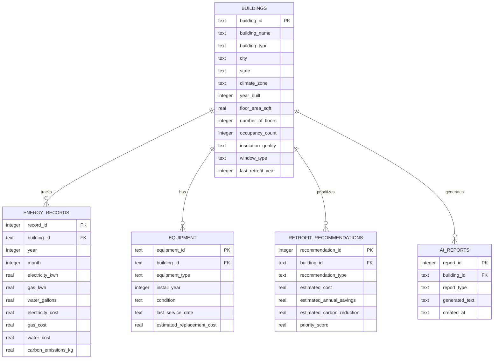

# EcoBuild Intelligence: Building Energy, Cost, Carbon, and Retrofit Analytics Platform

EcoBuild Intelligence is a building performance analytics platform that helps facility managers and sustainability teams analyze energy usage, operating costs, carbon emissions, risk scores, and retrofit priorities across a portfolio of buildings, with AI-assisted or rule-based building summaries and monthly reporting.

---

## 1. Project Summary
EcoBuild Intelligence is a complete, self-contained Python-based analytics application built with Streamlit, Pandas, Plotly Express, and SQLite. It provides multi-attribute building benchmarking, scoring models for risk and retrofit prioritization, and AI-assisted or rule-based performance analysis. The platform helps building owners and energy consultants identify high-cost, high-emission, and high-risk assets, and plan capital investment pipelines for building improvements.

## 2. Problem Statement
Commercial and institutional building portfolios represent one of the largest sources of energy waste and carbon emissions. Sustainability teams and asset managers face several core challenges:
*   Aggregating utility billing data across thousands of properties.
*   Identifying which assets are underperforming relative to size and occupancy.
*   Determining which assets represent high operational or maintenance risks.
*   Prioritizing capital improvement (retrofit) budgets to maximize energy savings and ROI.
*   Generating consistent energy auditing reports for board members or regulatory reporting.

## 3. Target Audience
*   **Facility Managers & Sustainability Teams**: To monitor carbon targets (GHG) and utility bills.
*   **Building Owners & REIT Asset Managers**: To optimize operating margins (OPEX) and direct capital improvements (CAPEX).
*   **Energy Auditors & Sustainability Consultants**: To generate performance baselines and recommendation roadmaps.
*   **Architects & Building Engineers**: To verify building insulation, HVAC, and glazing characteristics.

## 4. Solution Overview
EcoBuild Intelligence solves these problems by providing an end-to-end data processing, storage, and visual analysis workflow:
1.  **Data Ingestion & Mapping**: Ingests utility billing records or real-world benchmarking datasets (such as NYC LL84 or Seattle building energy datasets), maps schema structures, and provides a default synthetic building dataset.
2.  **Relational Database Engine**: Stores buildings, monthly billing metrics, system hardware, and retrofits in a local SQLite database after dataset generation or custom file loading.
3.  **Derived Financial & Engineering Metrics**: Computes Energy Use Intensity (EUI), Carbon Intensity, Cost per Square Foot, and Energy Cost Ratios.
4.  **Risk & Retrofit Priority Scoring Models**: Employs deterministic scoring models weighting building systems (HVAC, glazing, insulation) and historical usage.
5.  **AI Assistant & Summaries**: Employs natural language query matching and OpenAI API integrations (with a robust rule-based local fallback) to explain building risks and generate reports.

---

## 5. Core Platform Features
*   **CSV Upload & Benchmarking Schema Mapping**: Clean, align, and map arbitrary utility data or real-world benchmarking datasets (such as NYC LL84 or Seattle building energy datasets) to standardized internal metrics.
*   **Portfolio KPIs & Interactive Plotly Charts**: Visual distributions of EUI, emissions, and risk factors by property type.
*   **Interactive Asset Benchmarking**: Dynamic bubble charts correlating floor area vs. annual energy usage, colored by risk level.
*   **Risk Profile Analysis**: Ranks and filters portfolio assets based on calculated risk categories (Low, Medium, High, Critical).
*   **Retrofit CAPEX Pipeline Tracker**: Summarizes retrofit capital requirements, projected savings, and financial payback periods (Years).
*   **Building Profile Sheet**: Shows a comprehensive dashboard for a single selected building including its SQLite equipment inventory, monthly billing cost history, and AI-assisted or rule-based summary.
*   **Natural Language Portfolio Assistant**: A conversational chat interface to query the portfolio (e.g., finding old HVAC units or comparing building types).

---

## 6. Metric Calculations & Formulas

### Energy Use Intensity (EUI)
$$EUI = \frac{\text{Annual Energy Use (kWh)}}{\text{Floor Area (sqft)}}$$

### Total Annual Operating Cost
$$\text{Total Cost} = \text{Electricity Cost} + \text{Gas Cost} + \text{Maintenance Cost}$$

### Cost per Square Foot
$$\text{Cost / Sqft} = \frac{\text{Total Annual Operating Cost}}{\text{Floor Area (sqft)}}$$

### Carbon Intensity
$$\text{Carbon Intensity} = \frac{\text{Carbon Emissions (kg)}}{\text{Floor Area (sqft)}}$$

### Building Age & Retrofit Age
$$\text{Building Age} = \text{Current Year (2026)} - \text{Year Built}$$
$$\text{Years Since Retrofit} = \text{Current Year (2026)} - \text{Last Retrofit Year}$$

### Energy Cost Ratio
$$\text{Energy Cost Ratio} = \frac{\text{Electricity Cost} + \text{Gas Cost}}{\text{Total Annual Operating Cost}}$$

---

## 7. Multi-Factor Scoring Models

### Building Performance Risk Score (0-100)
The risk score weights utility performance indicators alongside building envelope and HVAC assets:
*   **High EUI (25%)**: Scaled linearly (0-100) within its building type from 10th percentile to 90th percentile.
*   **High Carbon Intensity (20%)**: Scaled linearly (0-100) within its building type.
*   **High Operating Cost per sqft (20%)**: Scaled linearly (0-100) within its building type.
*   **Aging HVAC System (10%)**: Scaled from 0 (Age $\le$ 5 years) to 100 (Age $\ge$ 20 years).
*   **Poor Envelope Insulation (10%)**: Poor = 100, Fair = 60, Good = 20, Excellent = 0.
*   **Inefficient Glazing (5%)**: Single Pane = 100, Double Pane = 30, Triple Pane = 0.
*   **No Recent Retrofit (10%)**: Scaled from 0 (Years $\le$ 3) to 100 (Years $\ge$ 15).

$$\text{Risk Score} = 0.25 \times S_{EUI} + 0.20 \times S_{Carbon} + 0.20 \times S_{Cost} + 0.10 \times S_{HVAC} + 0.10 \times S_{Insulation} + 0.05 \times S_{Glazing} + 0.10 \times S_{Retrofit}$$

*Risk Categories*: Low (0-25), Medium (26-50), High (51-75), Critical (76-100).

### Retrofit Priority Score (0-100)
Prioritizes buildings where retrofits yield the largest financial and environmental benefits:
$$\text{Retrofit Priority Score} = 0.40 \times \text{Risk Score} + 0.25 \times S_{\text{Energy Savings}} + 0.20 \times S_{\text{Carbon Reduction}} + 0.15 \times S_{\text{Cost Savings}}$$

*   **Energy Savings Score**: EUI reduction ($kWh/sqft$) scaled from 0 to 100.
*   **Carbon Reduction Score**: Carbon intensity reduction ($kg/sqft$) scaled from 0 to 100.
*   **Cost Savings Score**: Cost savings ($/sqft$) scaled from 0 to 100.

*Priority Categories*: Low (0-25), Medium (26-50), High (51-75), Critical (76-100).

### Estimated Savings Projections
Retrofit savings percentages are estimated dynamically based on the building risk profile:
*   **Low Risk**: 5% Utility Savings
*   **Medium Risk**: 10% Utility Savings
*   **High Risk**: 18% Utility Savings
*   **Critical Risk**: 25% Utility Savings

$$\text{Energy Savings (kWh)} = \text{Energy Use (kWh)} \times \text{Savings \%}$$
$$\text{Financial Cost Savings (\$)} = (\text{Electricity Cost} + \text{Gas Cost}) \times \text{Savings \%}$$
$$\text{Carbon Reduction (kg)} = \text{Carbon Emissions (kg)} \times \text{Savings \%}$$
$$\text{Payback Period (Years)} = \frac{\text{Estimated Retrofit Cost}}{\text{Estimated Cost Savings}}$$

---

## 8. Database Architecture
The platform seeds a local SQLite relational database (`database/ecobuild.db`) representing a clean normalized architecture:



---

## 9. Tech Stack
*   **Frontend**: Streamlit
*   **Data Processing**: Pandas, NumPy
*   **Visualizations**: Plotly Express
*   **Database**: SQLite
*   **AI Integration**: OpenAI API (with robust local rule-based fallback)
*   **Environment Management**: Python-dotenv

---

## 10. Project Directory Structure
```
ecobuild-intelligence/
│
├── app.py                      # Main landing dashboard
├── data/
│   ├── sample_buildings.csv    # Generated 2,500 building record dataset
│   └── (user_uploaded.csv)     # Local runtime data cache
│
├── pages/                      # Multi-page dashboard layouts
│   ├── 1_Portfolio_Overview.py
│   ├── 2_Building_Comparison.py
│   ├── 3_Risk_Analysis.py
│   ├── 4_Retrofit_Prioritization.py
│   ├── 5_Carbon_Sustainability.py
│   ├── 6_Building_Profile.py
│   └── 7_AI_Assistant.py
│
├── src/                        # Platform source logic
│   ├── data_loader.py          # Data ingestion & synthetic generator
│   ├── data_cleaning.py        # Column renaming & mapping
│   ├── metrics.py              # Performance calculations
│   ├── risk_scoring.py         # Multi-factor risk calculation
│   ├── retrofit.py             # Savings & retrofit prioritizations
│   ├── ai_reports.py           # OpenAI SDK and Local parser handlers
│   └── database.py             # SQLite DDL initializer and seeder
│
├── database/
│   ├── schema.sql              # Relational table definitions
│   └── ecobuild.db             # Local seeded SQLite instance
│
├── reports/
│   └── sample_monthly_report.md# Pre-generated portfolio summary output
│
├── visuals/
│   └── dashboard_screenshots_placeholder.md
│
├── .env.example
├── .gitignore
├── requirements.txt
└── README.md
```

---

## 11. Setup & Local Execution

### Prerequisites
*   Python 3.8 or higher installed.

### Installation Steps
1.  **Clone or navigate** to the project workspace directory:
    ```bash
    cd "c:\Users\karth\OneDrive\Documents\Projects\EcoBuild Intelligence"
    ```
2.  **Create and activate** a Python virtual environment:
    ```bash
    python -m venv venv
    # On Windows PowerShell
    .\venv\Scripts\Activate.ps1
    # On macOS/Linux
    source venv/bin/activate
    ```
3.  **Install the required dependencies**:
    ```bash
    pip install -r requirements.txt
    ```
4.  **Set up the environment variables** (Optional for OpenAI integrations):
    *   Copy `.env.example` to a new file named `.env`:
        ```bash
        cp .env.example .env
        ```
    *   Open `.env` and fill in your `OPENAI_API_KEY` to enable the full LLM chatbot features. If you skip this, the platform will automatically run in high-quality local rule-based fallback mode.

5.  **Run the Streamlit application**:
    ```bash
    streamlit run app.py
    ```

---

## 12. Screenshots Placeholder
*(Screenshots representing dashboard layouts, bubble charts, and SQL data integration will be placed in the `visuals/` directory)*

---

## 13. Future Platform Improvements
*   **Building Energy Modeling (BEM)**: Integrate with EnergyPlus or eQUEST engines to run real thermodynamic heat flow models.
*   **Live Utility API Integrations**: Hook into ENERGY STAR Portfolio Manager APIs or smart grid meters (Green Button API) to automate monthly imports.
*   **Machine Learning Predictions**: Replace rule-based savings percentages with random forest regression models trained on historic ASHRAE energy audits.

---

## 14. Resume Bullets
*   **Developed EcoBuild Intelligence**, a portfolio building energy analytics platform using Streamlit, Plotly, and SQLite, enabling building stakeholders to model EUI, carbon emissions, and operational cost savings.
*   **Implemented a multi-factor Risk & Retrofit Prioritization model** that weights building HVAC age, insulation, window glazing, and carbon intensity to rank properties into Low, High, or Critical risk profiles.

*   **Built a dual-mode reporting and query engine** integrating OpenAI API and a custom rule-based local parser, capable of executing pandas queries dynamically to respond to natural language portfolio questions.
*   **Designed a relational SQL seeder** using SQLite to generate monthly billing records, seasonal HVAC energy variations, and hardware inventory details for 2,500 buildings.

---

## 15. Technical Interview Explanation
*   **Why SQLite and Pandas?**: I chose Pandas for rapid column operations, array manipulations, and risk calculations. I mirrored this memory state into SQLite because building portfolios require structured relationships (e.g., one building has many monthly utility billing entries and multiple hardware assets). By using SQLite, I demonstrate a database architecture suitable for scale and standard SQL querying.
*   **Why Normalization in Risk Scoring?**: Buildings behave differently by property type (e.g., a lab consumes 5x more energy than an apartment). Scoring EUI globally would categorize all hospitals and labs as critical risk. By grouping by `building_type` and normalizing the EUI percentile score, the model ranks buildings fairly against peers of the same category.
*   **Why Dual AI Mode?**: In professional environments, API keys can be revoked or restricted due to client data privacy. Implementing a rule-based query parser guarantees that the application runs locally without any cloud dependencies, falling back to OpenAI only when explicit credentials are set.

---
**Author**: Sharadha Karthikeyan
